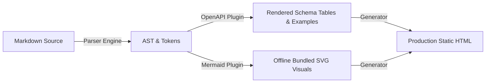
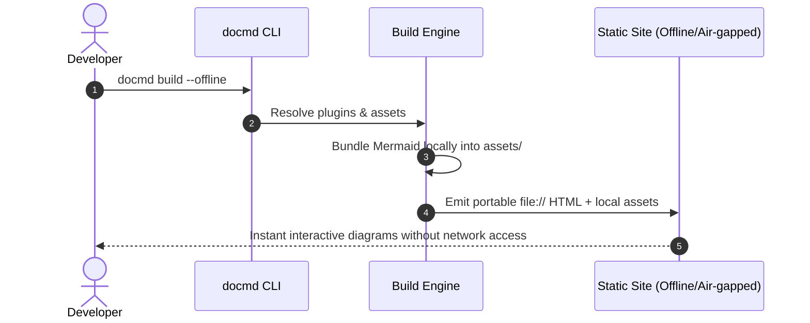

# Mermaid Diagrams Preview

In docmd 0.9.3 ([Issue #198](https://github.com/docmd-io/docmd/issues/198)), the Mermaid plugin bundles its engine assets locally into `assets/js/init-mermaid.js` rather than loading from external CDNs, making diagrams 100% functional in **offline builds** (`--offline`) and air-gapped deployments.

## Architecture Workflow

## Interactive Architecture Diagram

::: mermaid "System Architecture" icon=layers align=center
graph TD
    Client["Browser / Offline Consumer"]
    Core["@docmd/core Generator"]
    Parser["@docmd/parser (Normalized URLs)"]
    OpenAPI["@docmd/plugin-openapi (Examples & Schemas)"]
    Mermaid["@docmd/plugin-mermaid (Offline Assets)"]

    Client --> Core
    Core --> Parser
    Core --> OpenAPI
    Core --> Mermaid
:::

## Sequence Flow

