# Mermaid Diagrams

Mermaid is a JavaScript-based diagramming and charting tool that uses Markdown-inspired text definitions to create and modify diagrams dynamically. docmd has built-in support for Mermaid diagrams with automatic light/dark theme switching.

::: callout tip
All Mermaid diagrams automatically adapt to your site's light/dark theme!
:::

## Flowchart

Flowcharts are used to represent workflows or processes. They show the steps as boxes of various kinds, and their order by connecting them with arrows.

**Code:**

````markdown
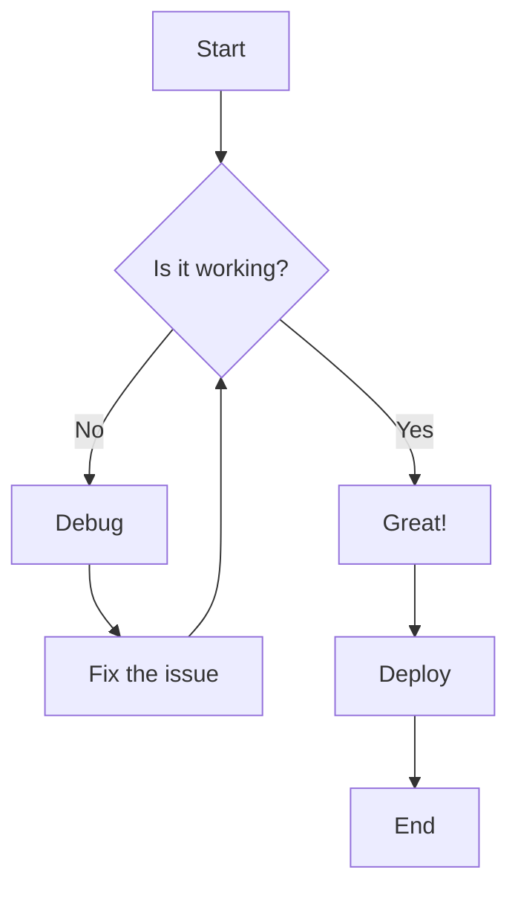
````

**Rendered Preview:**


## Sequence Diagram

Sequence diagrams show how processes operate with one another and in what order. They capture the interaction between objects in the context of a collaboration.

**Code:**

````markdown
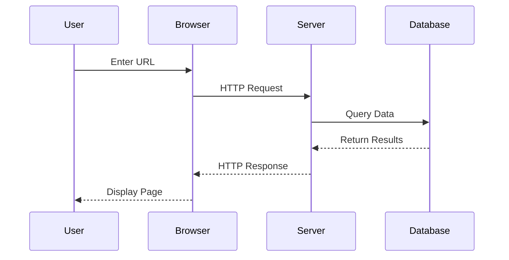
````

**Rendered Preview:**


## Class Diagram

Class diagrams are the main building block of object-oriented modeling. They show the structure of a system by showing the system's classes, their attributes, operations, and relationships.

**Code:**

````markdown
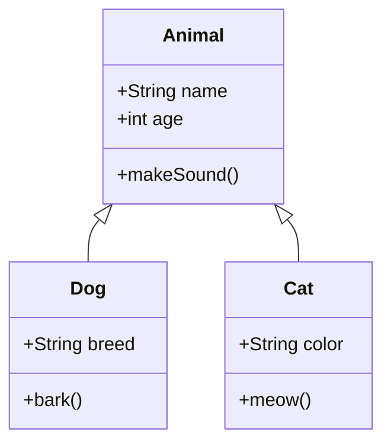
````

**Rendered Preview:**


## Entity Relationship Diagram

Entity Relationship Diagrams are used to model the logical structure of databases. They show entities (tables) and the relationships between them.

**Code:**

````markdown
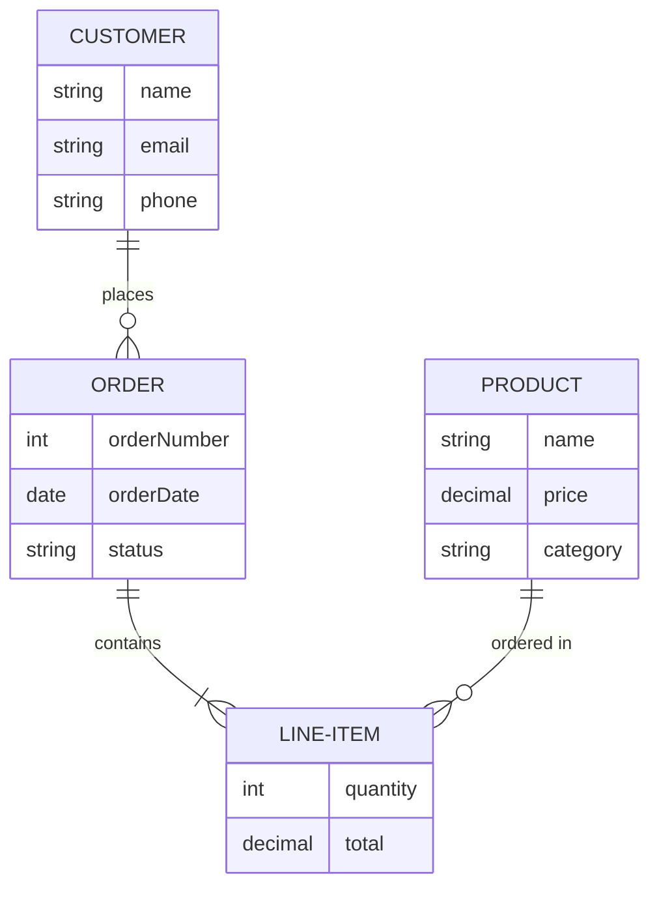
````

**Rendered Preview:**


## State Diagram

State diagrams describe the states of an object and the transitions between those states. They're useful for modeling the lifecycle of an object.

**Code:**

````markdown
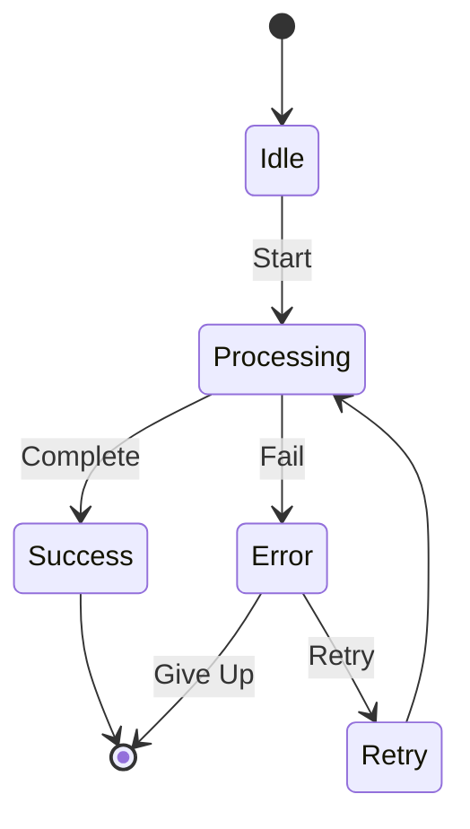
````

**Rendered Preview:**


## User Journey

User journey diagrams visualize the journey users take when using your product or service. They help identify pain points and opportunities for improvement.

**Code:**

````markdown
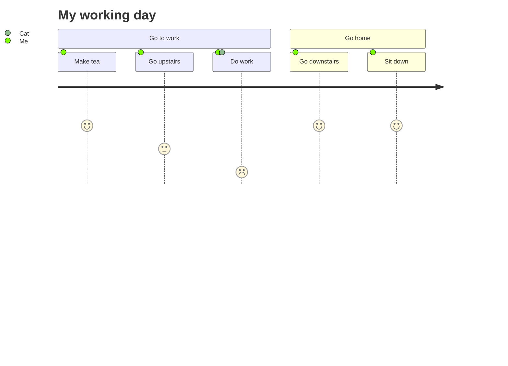
````

**Rendered Preview:**


## Gantt Chart

Gantt charts illustrate a project schedule, showing the start and finish dates of elements and summary elements of a project.

**Code:**

````markdown
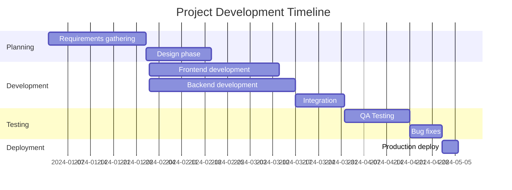
````

**Rendered Preview:**


## Pie Chart

Pie charts are circular statistical graphics divided into slices to illustrate numerical proportions.

**Code:**

````markdown
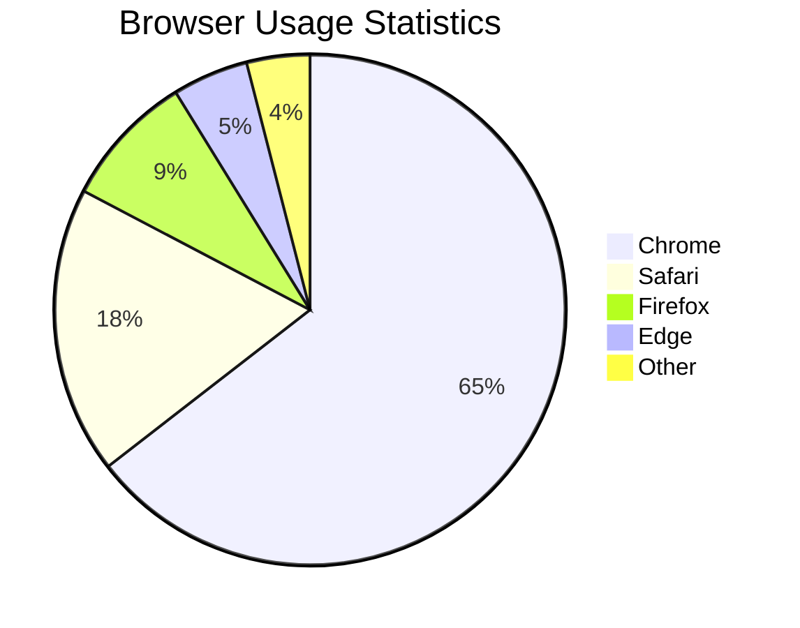
````

**Rendered Preview:**


## Quadrant Chart

Quadrant charts are useful for prioritization and categorizing items based on two dimensions.

**Code:**

````markdown
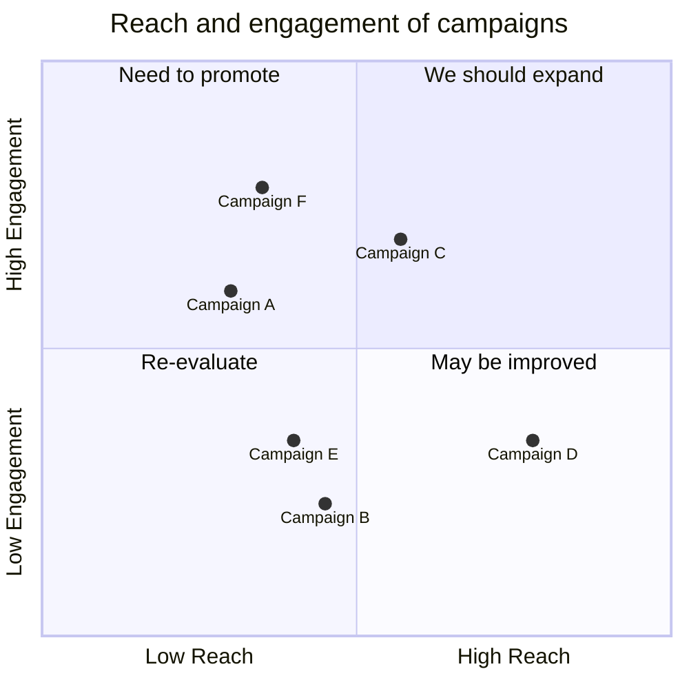
````

**Rendered Preview:**


## Git Graph

Git graphs visualize Git branching and merging operations, making it easier to understand version control workflows.

**Code:**

````markdown
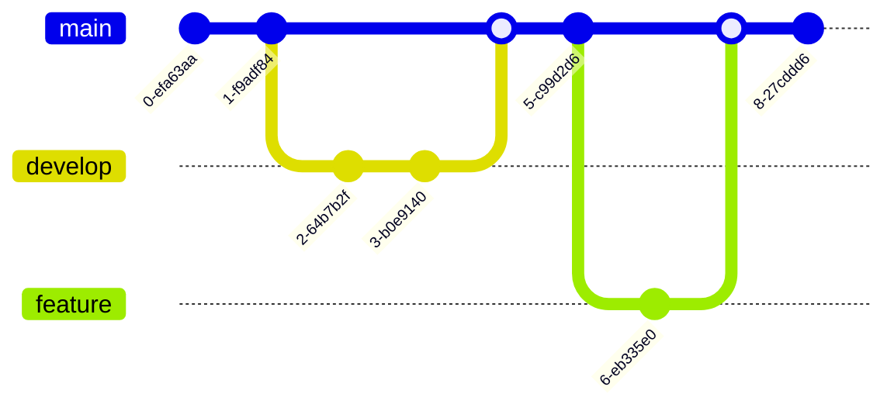
````

**Rendered Preview:**

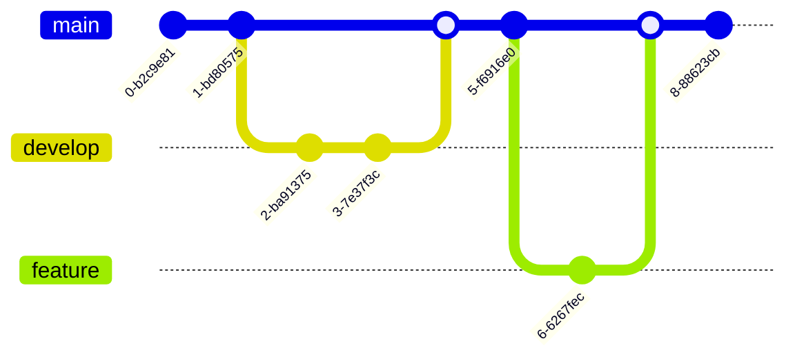

## Mindmap

Mindmaps are diagrams used to visually organize information hierarchically, showing relationships among pieces of the whole.

**Code:**

````markdown
```mermaid
mindmap
  root((docmd))
    Features
      Markdown Support
      Custom Containers
      Themes
        Light Mode
        Dark Mode
      Plugins
    Documentation
      Getting Started
      Configuration
      Deployment
    Community
      GitHub
      Contributors
      Issues
```
````

**Rendered Preview:**

```mermaid
mindmap
  root((docmd))
    Features
      Markdown Support
      Custom Containers
      Themes
        Light Mode
        Dark Mode
      Plugins
    Documentation
      Getting Started
      Configuration
      Deployment
    Community
      GitHub
      Contributors
      Issues
```

## Timeline

Timeline diagrams show events in chronological order along a line, making it easy to understand the sequence and duration of events.

**Code:**

````markdown
```mermaid
timeline
    title History of Web Development
    2000 : Web 1.0
         : Static HTML pages
    2005 : Web 2.0
         : Dynamic content
         : AJAX revolution
    2010 : Mobile First
         : Responsive design
    2015 : Modern Frameworks
         : React
         : Vue
         : Angular
    2020 : JAMstack Era
         : Static Site Generators
         : Serverless
```
````

**Rendered Preview:**

```mermaid
timeline
    title History of Web Development
    2000 : Web 1.0
         : Static HTML pages
    2005 : Web 2.0
         : Dynamic content
         : AJAX revolution
    2010 : Mobile First
         : Responsive design
    2015 : Modern Frameworks
         : React
         : Vue
         : Angular
    2020 : JAMstack Era
         : Static Site Generators
         : Serverless
```

## XY Chart

XY charts display data as a series of points on a coordinate plane, useful for showing correlations and trends.

**Code:**

````markdown
```mermaid
xychart-beta
    title "Sales Revenue by Quarter"
    x-axis [Q1, Q2, Q3, Q4]
    y-axis "Revenue (in $1000)" 0 --> 100
    bar [50, 60, 70, 85]
    line [45, 55, 75, 80]
```
````

**Rendered Preview:**

```mermaid
xychart-beta
    title "Sales Revenue by Quarter"
    x-axis [Q1, Q2, Q3, Q4]
    y-axis "Revenue (in $1000)" 0 --> 100
    bar [50, 60, 70, 85]
    line [45, 55, 75, 80]
```

## Kanban Board

Kanban boards visualize work at various stages of a process, helping teams manage workflow and identify bottlenecks.

**Code:**

````markdown
```mermaid
---
config:
  kanban:
    ticketBaseUrl: 'https://mermaidchart.atlassian.net/browse/#TICKET#'
---
kanban
  Todo
    [Create Documentation]
    docs[Create Blog about the new diagram]
  [In progress]
    id6[Create renderer so that it works in all cases. We also add some extra text here for testing purposes. And some more just for the extra flare.]
  id9[Ready for deploy]
    id8[Design grammar]@{ assigned: 'knsv' }
  id10[Ready for test]
    id4[Create parsing tests]@{ ticket: MC-2038, assigned: 'K.Sveidqvist', priority: 'High' }
    id66[last item]@{ priority: 'Very Low', assigned: 'knsv' }
  id11[Done]
    id5[define getData]
    id2[Title of diagram is more than 100 chars when user duplicates diagram with 100 char]@{ ticket: MC-2036, priority: 'Very High'}
    id3[Update DB function]@{ ticket: MC-2037, assigned: knsv, priority: 'High' }

  id12[Can't reproduce]
    id3[Weird flickering in Firefox]

```
````

**Rendered Preview:**

```mermaid
---
config:
  kanban:
    ticketBaseUrl: 'https://mermaidchart.atlassian.net/browse/#TICKET#'
---
kanban
  Todo
    [Create Documentation]
    docs[Create Blog about the new diagram]
  [In progress]
    id6[Create renderer so that it works in all cases. We also add some extra text here for testing purposes. And some more just for the extra flare.]
  id9[Ready for deploy]
    id8[Design grammar]@{ assigned: 'knsv' }
  id10[Ready for test]
    id4[Create parsing tests]@{ ticket: MC-2038, assigned: 'K.Sveidqvist', priority: 'High' }
    id66[last item]@{ priority: 'Very Low', assigned: 'knsv' }
  id11[Done]
    id5[define getData]
    id2[Title of diagram is more than 100 chars when user duplicates diagram with 100 char]@{ ticket: MC-2036, priority: 'Very High'}
    id3[Update DB function]@{ ticket: MC-2037, assigned: knsv, priority: 'High' }

  id12[Can't reproduce]
    id3[Weird flickering in Firefox]

```

## Architecture Diagram

Architecture diagrams show the high-level structure of software systems, including components and their relationships.

**Code:**

````markdown
```mermaid
architecture-beta
    group api(cloud)[API Layer]
    
    service db(database)[Database] in api
    service cache(disk)[Cache] in api
    service queue(disk)[Queue] in api
    
    service server(server)[API Server] in api
    
    server:L -- R:db
    server:B -- T:cache
    server:T -- B:queue
```
````

**Rendered Preview:**

```mermaid
architecture-beta
    group api(cloud)[API Layer]
    
    service db(database)[Database] in api
    service cache(disk)[Cache] in api
    service queue(disk)[Queue] in api
    
    service server(server)[API Server] in api
    
    server:L -- R:db
    server:B -- T:cache
    server:T -- B:queue
```

## C4 Diagram

C4 diagrams provide different levels of abstraction for software architecture visualization, from system context down to code.

**Code:**

````markdown
```mermaid
C4Context
    title System Context diagram for Internet Banking System
    
    Person(customerA, "Personal Banking Customer", "A customer of the bank")
    Person(customerB, "Business Banking Customer", "A business customer")
    
    System(SystemAA, "Internet Banking System", "Allows customers to view information about their accounts")
    
    System_Ext(SystemE, "Mainframe Banking System", "Stores all core banking information")
    System_Ext(SystemC, "E-mail system", "The internal Microsoft Exchange system")
    
    Rel(customerA, SystemAA, "Uses")
    Rel(customerB, SystemAA, "Uses")
    
    Rel(SystemAA, SystemE, "Gets account information from")
    Rel(SystemAA, SystemC, "Sends e-mails", "SMTP")
```
````

**Rendered Preview:**

```mermaid
C4Context
    title System Context diagram for Internet Banking System
    
    Person(customerA, "Personal Banking Customer", "A customer of the bank")
    Person(customerB, "Business Banking Customer", "A business customer")
    
    System(SystemAA, "Internet Banking System", "Allows customers to view information about their accounts")
    
    System_Ext(SystemE, "Mainframe Banking System", "Stores all core banking information")
    System_Ext(SystemC, "E-mail system", "The internal Microsoft Exchange system")
    
    Rel(customerA, SystemAA, "Uses")
    Rel(customerB, SystemAA, "Uses")
    
    Rel(SystemAA, SystemE, "Gets account information from")
    Rel(SystemAA, SystemC, "Sends e-mails", "SMTP")
```

## Best Practices

When using Mermaid diagrams in your documentation:

1. **Keep it Simple**: Start with simple diagrams and add complexity only when needed
2. **Use Clear Labels**: Make sure all nodes and connections are clearly labeled
3. **Consider Your Audience**: Adjust the level of detail based on who will read the documentation
4. **Test Both Themes**: Always check how your diagrams look in both light and dark modes
5. **Add Context**: Use callouts or text around diagrams to explain what they represent

::: callout info
For more detailed Mermaid syntax and options, visit the [official Mermaid documentation](https://mermaid.js.org/).
:::

